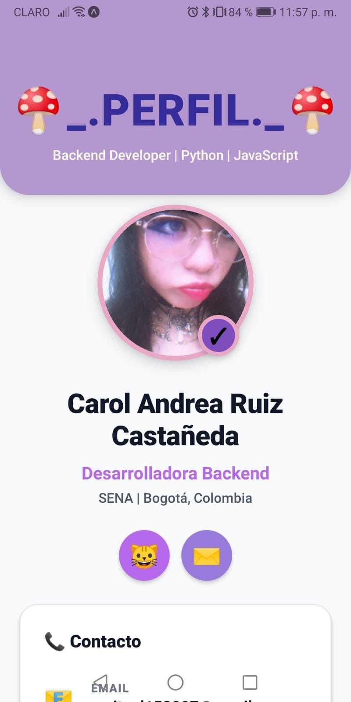
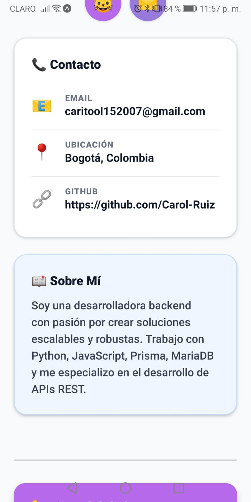
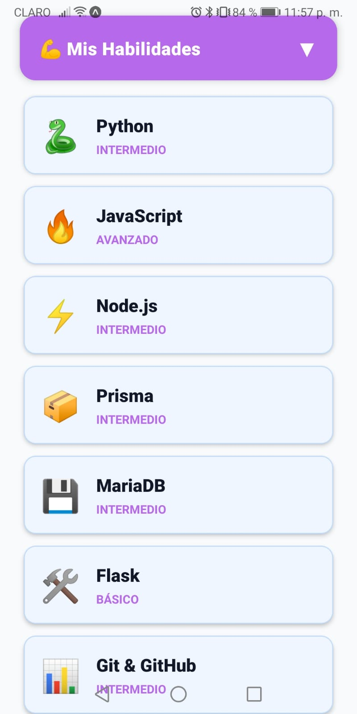
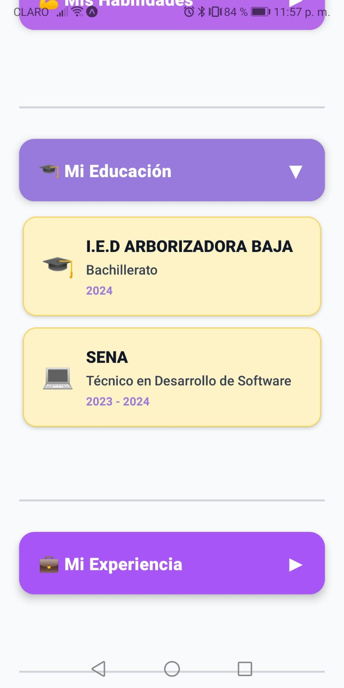
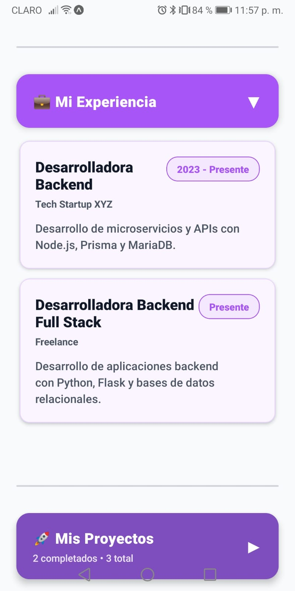
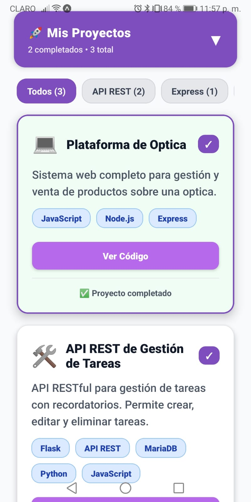
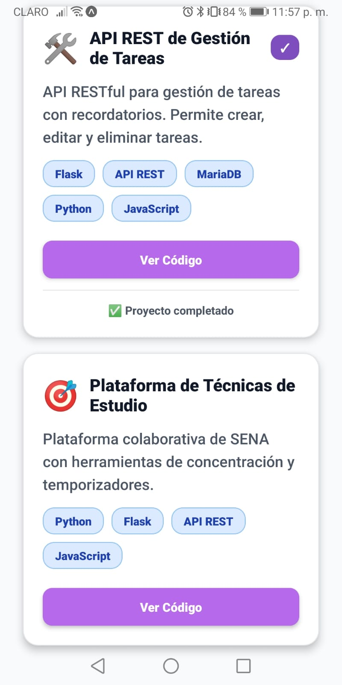
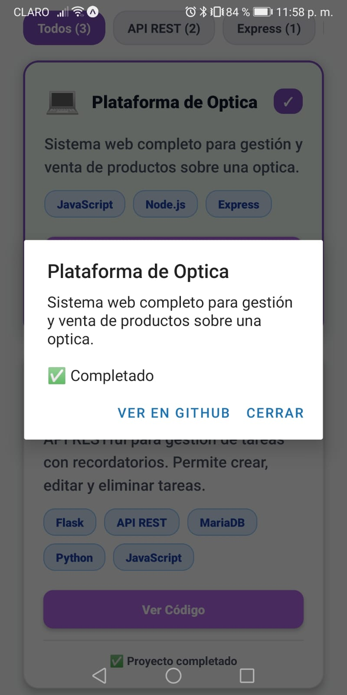
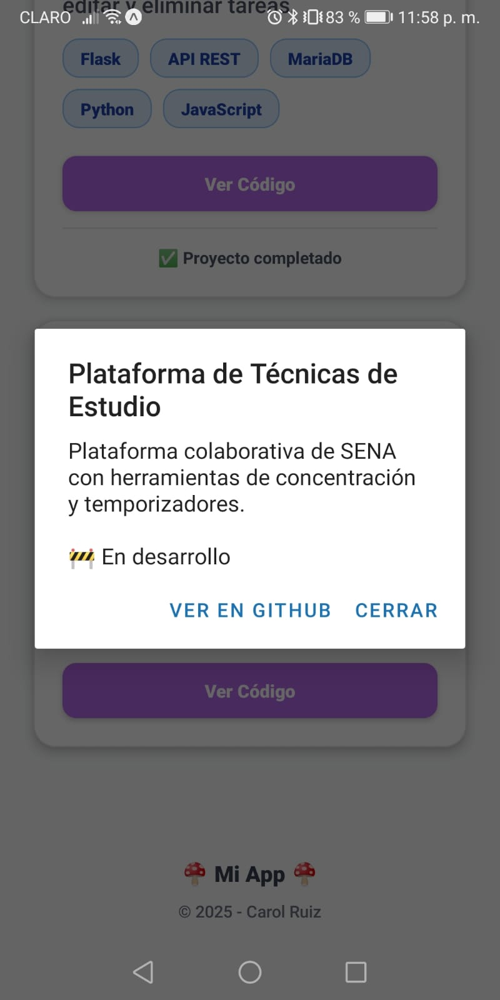
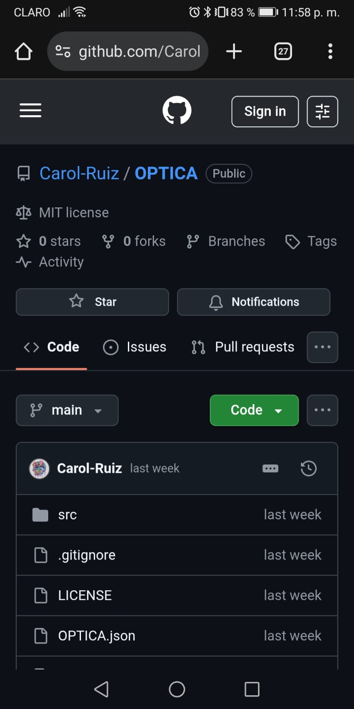

# 📱 Proyecto - Semana 1  
## 🧩 Mi App Personal  

---

### 📘 Descripción General  
**Mi App Personal** es una aplicación desarrollada en **React Native** como parte del **Proyecto de la Semana 1** del Bootcamp.  

El propósito de esta app es integrar todos los conceptos fundamentales vistos durante la primera semana de formación, incluyendo **componentes básicos, diseño con Flexbox, estilos con TailwindCSS, estado local y renderizado de listas**.

---

### 🎯 Objetivo del Proyecto  
Construir una aplicación personal completa que contenga información relevante del desarrollador, presente habilidades técnicas y muestre proyectos personales dentro de una misma vista con desplazamiento vertical (**ScrollView**).

---


## 🧠 Conceptos Aplicados  

| Concepto | Descripción |
|-----------|-------------|
| **Componentes Básicos** | Uso de componentes como `View`, `Text`, `Image`, `ScrollView` y `TouchableOpacity`. |
| **Layouts con Flexbox** | Distribución de elementos con propiedades como `flexDirection`, `justifyContent`, `alignItems` y `gap`. |
| **Estilos con TailwindCSS** | Integración de Tailwind para aplicar estilos rápidos y consistentes (`className="bg-blue-500 p-4 rounded-xl"`). |
| **Componentes Reutilizables** | Creación de componentes independientes como `CardProyecto` o `SkillItem`. |
| **Renderizado de Listas** | Implementación de `FlatList` o `map()` para mostrar habilidades y proyectos. |
| **Estado Local Básico** | Uso de `useState` para manejar interacciones simples o estados visuales. |

---

## 🧩 Estructura del Proyecto  

```
📦 bc-reactnative-semana01-proyecto
├── 📁 assets/                 # Imágenes, íconos y recursos gráficos
├── 📁 components/             # Componentes reutilizables
│   ├── Perfil.jsx             # Sección de perfil con avatar y biografía
│   ├── Habilidades.jsx        # Lista de habilidades
│   ├── ProyectoCard.jsx       # Card individual de proyecto
├── 📁 screens/                # Pantalla principal (App)
│   ├── HomeScreen.jsx         # Contenedor principal con scroll
├── App.js                     # Punto de entrada de la aplicación
├── tailwind.config.js         # Configuración de TailwindCSS
├── package.json               # Dependencias y scripts
└── README.md                  # Documento descriptivo del proyecto
```

---

## 🧍‍♀️ Secciones Principales  

### 🧾 1. Perfil  
Contiene información personal del desarrollador:  
- Imagen de perfil (avatar)  
- Nombre y pequeña biografía  
- Uso de `View`, `Image` y `Text` con estilos personalizados  

### 💻 2. Habilidades  
Lista de habilidades técnicas o tecnologías aprendidas.  
- Se renderizan dinámicamente desde un array de datos.  
- Cada habilidad se muestra en una card simple con ícono y nombre.  

### 🚀 3. Proyectos  
Muestra una galería de proyectos desarrollados o ideas futuras.  
- Cada proyecto se representa con un **Card** que incluye:  
  - Imagen de portada  
  - Nombre del proyecto  
  - Pequeña descripción  
- Se estructura con **Flexbox** y **TailwindCSS**.  

---

## 🧠 Funcionamiento de la App  

1. Al iniciar la aplicación, se carga una vista **scrollable** que contiene las tres secciones: Perfil, Habilidades y Proyectos.  
2. Cada sección se renderiza como un componente independiente dentro del contenedor principal (`ScrollView`).  
3. Los estilos se manejan con **TailwindCSS** para mantener un diseño limpio, adaptable y coherente.  
4. Los datos de habilidades y proyectos pueden almacenarse en arreglos dentro del código o importarse desde archivos de datos.  
5. La app es completamente **responsiva** y se adapta a distintos tamaños de pantalla.

🎥 **Video de Funcionamiento:**  
👉 [Haz clic aquí para ver el video demostrativo](https://drive.google.com/drive/folders/1jgwZm_fqqu6u2HSWLFm_ZLULZ7LIV30e?usp=sharing)

---

## 🖼️ Capturas de Pantalla  

| Sección          | Vista                                          |
|------------------|------------------------------------------------|
| Funcionalidad 1  |  |
| Funcionalidad 2  |  |
| Funcionalidad 3  |  |
| Funcionalidad 4  |  |
| Funcionalidad 5  |  |
| Funcionalidad 6  |  |
| Funcionalidad 7  |  |
| Funcionalidad 8  |  |
| Funcionalidad 9  |  |
| Funcionalidad 10 |  |
| Funcionalidad 11 |  |


---

## ⚙️ Instrucciones de Instalación  

1. **Clona el repositorio:**
   ```bash
   git clone https://github.com/Carol-Ruiz/bc-reactnative-semana01-proyecto.git
   ```
2. **Ingresa al directorio del proyecto:**
   ```bash
   cd bc-reactnative-semana01-proyecto
   ```
3. **Instala las dependencias:**
   ```bash
   npm install
   ```
4. **Ejecuta la aplicación:**
   ```bash
   npm start
   ```
   Luego abre en tu emulador o dispositivo móvil con Expo Go.

---

## 🧑‍💻 Autor  

**Carol Ruiz**  
📅 Fecha: 21/10/2025  
Desarrolladora en formación | Proyecto Semana 1  
🌐 [GitHub: Carol-Ruiz](https://github.com/Carol-Ruiz)

---

## 🏁 Conclusión  

Este proyecto representa el primer paso en la construcción de aplicaciones móviles con **React Native**, aplicando las bases de diseño, estructura de componentes y control de estado.  
La experiencia permite consolidar los conocimientos teóricos de la semana en una aplicación funcional, visualmente atractiva y completamente personalizable.
